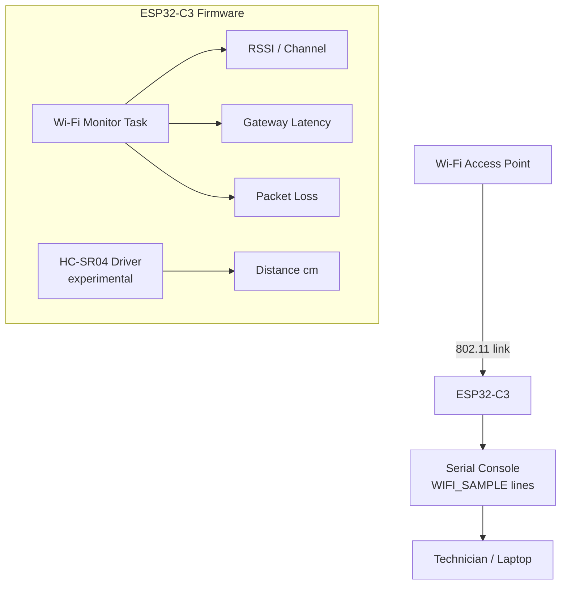
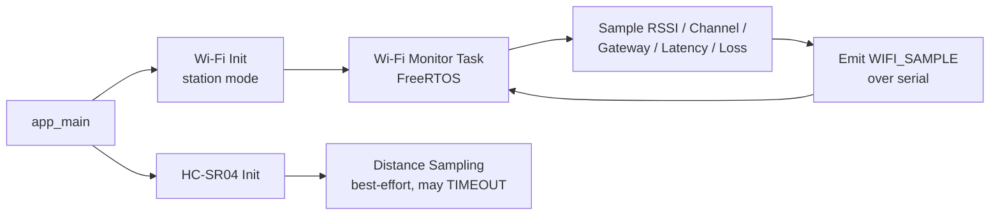

# Wi-Fi Placement Sentinel

**A portable ESP32-C3 based network AP analyzer for warehouses and other industrial environments — designed to help identify locations where wireless link quality unexpectedly degrades.**

Wi-Fi Placement Sentinel is a handheld prototyping device built on the ESP32-C3. It connects to a Wi-Fi access point in station mode and continuously logs RSSI, channel, gateway latency, and packet loss, with experimental ultrasonic distance sensing to add physical-distance context. It is intended as a lightweight, walk-around field tool a technician can carry to flag areas that may need further RF investigation — not as a replacement for a proper spectrum analyzer or Wi-Fi survey kit.

The firmware itself is built and iterated on with **[FirmGen](#https://craftifai.com/products/firmgen)**, which turns natural-language firmware requirements into ESP-IDF code — each iteration is then flashed and validated on real ESP32-C3 hardware before the next requirement is written.

---

## Table of Contents

1. [Key Features](#key-features)
2. [Why This Project Exists](#why-this-project-exists)
3. [How It Works](#how-it-works)
4. [System Architecture](#system-architecture)
5. [Hardware](#hardware)
6. [Hardware Wiring](#hardware-wiring)
7. [Software Stack](#software-stack)
8. [Firmware Architecture](#firmware-architecture)
9. [Resources](#resources)
10. [Installation / Setup](#installation--setup)
11. [Configuration](#configuration)
12. [Building and Flashing](#building-and-flashing)
13. [Serial Monitoring](#serial-monitoring)
14. [Example Output](#example-output)
15. [Testing and Observations](#testing-and-observations)
16. [Limitations](#limitations)
17. [Future Improvements](#future-improvements)
18. [Project Structure](#project-structure)
19. [Development Notes](#development-notes)
20. [License](#license)

---

## Key Features

| Feature | Status |
|---|---|
| Wi-Fi station-mode connection with auto-reconnect | Implemented |
| RSSI measurement | Implemented |
| Wi-Fi channel reporting | Implemented |
| DHCP gateway discovery | Implemented |
| Gateway round-trip latency measurement | Implemented |
| Packet-loss measurement | Implemented |
| Serial telemetry output (`WIFI_SAMPLE` lines) | Implemented |
| HC-SR04 ultrasonic distance sensing | Experimental — intermittent timeouts observed |
| AP orientation detection | **Not implemented, not planned** — RSSI cannot reliably determine this |
| Automated obstruction classification | Not implemented |

---

## Why This Project Exists

Wireless coverage in warehouses, labs, and industrial floors degrades for a variety of reasons: poor access-point placement, physical obstructions, metal racking and machinery, structural walls, RF interference, and general coverage gaps. Diagnosing this normally means bringing in a dedicated Wi-Fi survey tool or a laptop running network-analysis software — overhead that isn't always available to a technician doing a quick walk-through.

Wi-Fi Placement Sentinel is an attempt at a low-cost, portable alternative: a handheld device that samples link-quality metrics continuously as it's carried through a space, so a technician can quickly notice *where* connectivity gets worse than expected. It does not try to determine *why* — that still requires further investigation — but it gives an early, cheap signal of where to look.

---

## How It Works

The firmware connects to a configured Wi-Fi access point in station mode and runs a periodic monitoring loop that:

1. Reads the current RSSI and channel from the Wi-Fi driver
2. Resolves the DHCP gateway address
3. Measures round-trip latency to the gateway
4. Estimates packet loss over a small sample of probes
5. Emits a structured `WIFI_SAMPLE` line over the serial console for each cycle

HC-SR04 ultrasonic distance readings are captured alongside this loop when the sensor responds correctly, to give a rough physical-distance reference for a given measurement — this part of the system is still experimental (see [Limitations](#limitations)).

No single metric is treated as authoritative. RSSI, latency, and packet loss are logged together because each can shift independently — a location can have strong RSSI but high latency or packet loss, and vice versa.

---

## System Architecture



The monitoring task and the HC-SR04 driver run as separate concerns in firmware: a distance-read timeout does not block or delay Wi-Fi sampling.

---

## Hardware

| Component | Role | Notes |
|---|---|---|
| ESP32-C3 development board | Wi-Fi station mode, monitoring loop, serial output | |
| HC-SR04 ultrasonic sensor | Distance-to-AP context | Experimental — see [wiring](#hardware-wiring) and [limitations](#limitations) |
| Breadboard | Prototyping | |
| Jumper wires | Prototyping | |
| USB cable | Power + serial | |
| Smartphone hotspot | Current test access point | Not an enterprise AP — see [Limitations](#limitations) |

---

## Hardware Wiring

### HC-SR04 → ESP32-C3

| HC-SR04 Pin | ESP32-C3 Pin |
|---|---|
| VCC | 3.3V |
| GND | GND |
| TRIG | GPIO1 |
| ECHO | GPIO3 |

> ⚠️ **Voltage warning:** Standard HC-SR04 modules are commonly rated for 5V operation, and many produce a 5V level on ECHO. The ESP32-C3's GPIOs are 3.3V-tolerant and **can be damaged by a direct 5V ECHO connection**. If your HC-SR04 module is a 5V variant, use a voltage divider or a logic-level shifter on the ECHO line before connecting it to the ESP32-C3. Confirm your specific module's actual operating voltage before wiring it directly.

---

## Software Stack

| Layer | Technology |
|---|---|
| Target MCU | ESP32-C3 |
| SDK | ESP-IDF and Firmgen |
| RTOS | FreeRTOS |
| Language | C/C++ |
| Networking | Wi-Fi station mode, gateway latency probing, packet-loss sampling |
| Sensing | HC-SR04 ultrasonic ranging (experimental) |

---

## Firmware Architecture

At a high level, the firmware is organized around one long-running Wi-Fi monitoring task plus a separate, best-effort distance-sensing path:



The Wi-Fi monitoring task does not block on distance-sensing results — a `TIMEOUT` from the HC-SR04 path does not stall or delay the Wi-Fi sampling cycle.

Each of these pieces — the monitoring task, the HC-SR04 driver, the serial telemetry format — was scaffolded and refined incrementally through FirmGen: a requirement is described in plain language, FirmGen produces the corresponding ESP-IDF change, and the result is flashed and checked on hardware before moving to the next requirement. See [Development Notes](#development-notes) for how that loop is used in practice.

---

## Resources

| Resource | Link |
|---|---|
| Firmware package (FirmGen-generated, hardware-validated) | [Google Drive folder](https://drive.google.com/drive/folders/1f0HW022s0XVICStRTLlObq907P5-6NeR?usp=drive_link) |
| Firmgen task photos | [Google Drive folder](https://drive.google.com/drive/folders/1KJURYm1enSdwUEfygDc2UrblKAR0jW07?usp=drive_link) |

> These are external Drive folders, not versioned in this repository. If you'd rather keep firmware history in-repo, migrate the package contents into `firmware/` and drop this row once that's done.

---

## Installation / Setup

### Prerequisites

- [ESP-IDF](https://docs.espressif.com/projects/esp-idf/en/stable/esp32c3/get-started/index.html) installed and set up for the `esp32c3` target
- Firmgen sdk installed and setup with esp-idf toolchain-v5.5(optional, firmware tasks can be done manually also or by using firmgen)
- An ESP32-C3 development board connected via USB
- A Wi-Fi access point to connect to (a smartphone hotspot works for testing)

### Clone the repository

```bash
git clone https://github.com/<your-username>/wifi-placement-sentinel.git
cd wifi-placement-sentinel/firmware
```

---

## Configuration

### Wi-Fi credentials — do not commit these

Do not hardcode Wi-Fi SSID/password in source files that get committed to GitHub. Use one of the following instead:

**Option A — `idf.py menuconfig`**

```bash
idf.py menuconfig
```

Set your SSID and password under the project's Wi-Fi configuration menu. This is written to `sdkconfig`, which should **not** be committed (see [`.gitignore`](#gitignore) below) since it can contain your local credentials and machine-specific settings.

**Option B — local, untracked config header**

If the firmware reads credentials from a header (e.g. `main/wifi_credentials.h`), keep a template committed and the real file untracked:

```bash
# main/wifi_credentials.example.h  (committed)
#define WIFI_SSID     "your-ssid-here"
#define WIFI_PASSWORD "your-password-here"

# main/wifi_credentials.h  (untracked, .gitignore'd)
cp main/wifi_credentials.example.h main/wifi_credentials.h
# then edit main/wifi_credentials.h with real values
```

### Recommended `.gitignore`

```gitignore
# Build artifacts
build/
*.bin
*.elf
*.map

# ESP-IDF local configuration (may contain credentials/machine-specific paths)
sdkconfig
sdkconfig.old

# Credentials
main/wifi_credentials.h

# IDE / editor files
.vscode/
.idea/
*.swp

# OS files
.DS_Store
```

---

## Building and Flashing

```bash
idf.py set-target esp32c3
idf.py build
idf.py -p /dev/ttyUSB0 flash   # adjust the serial port for your OS
idf.py -p /dev/ttyUSB0 monitor
```

On Windows, the port is typically something like `COM3`; on macOS, `/dev/cu.usbserial-XXXX` or similar.

---

## Serial Monitoring

Once flashed, the device connects to the configured access point and begins emitting periodic `WIFI_SAMPLE` lines over serial. Use `idf.py monitor` (or any serial terminal at the configured baud rate) to view them live. Exit the monitor with `Ctrl+]`.

---

## Example Output

**Healthy link:**

```text
WIFI_SAMPLE uptime_ms=...
status=CONNECTED
rssi_dBm=-30
channel=1
gateway=10.133.5.246
latency_ms=8
packet_loss_pct=0
```

**Degraded link:**

```text
WIFI_SAMPLE uptime_ms=...
status=CONNECTED
rssi_dBm=-59
channel=1
gateway=10.133.5.246
latency_ms=253
packet_loss_pct=14
```

**HC-SR04 experimental output (may occur):**

```text
distance_cm=N/A
status=TIMEOUT
```

---

## Testing and Observations

Testing so far has used a smartphone hotspot as the access point, in an informal indoor environment — not a controlled RF chamber or enterprise AP setup. The following are qualitative observations from that testing, not calibrated benchmarks:

| Test | Observation |
|---|---|
| Moving closer to the AP | RSSI generally improved |
| Moving farther from the AP | RSSI generally decreased |
| Rotating the phone at roughly constant distance | Relatively small RSSI change — up to roughly 10 dBm in this environment |
| Placing a metal object between AP and device at roughly constant distance | RSSI decreased by roughly 10–15 dBm |
| Healthy-link example | RSSI ≈ -30 dBm, latency ≈ 5–10 ms, packet loss 0% |
| Degraded-link example | RSSI ≈ -59 dBm, latency ≈ 253 ms, packet loss ≈ 14% |

**Engineering takeaway:** RSSI alone does not capture overall link quality. Latency and packet loss can move independently of RSSI, which is why this project tracks all three rather than relying on signal strength alone. The small RSSI change observed under phone rotation, relative to the larger change from an intervening metal object, is also why this project does **not** attempt to infer AP orientation from RSSI — the signal isn't distinct enough for that in this testing.

---

## Limitations

This is a prototype, and its results should be read with that in mind:

- Testing so far has used a **smartphone hotspot**, not an enterprise-grade access point — behavior on managed/enterprise Wi-Fi infrastructure has not been validated.
- **RSSI cannot uniquely identify the cause** of a degraded reading — a low RSSI could stem from distance, obstruction, interference, or several factors at once.
- **RSSI cannot directly determine AP orientation.** Observed rotation-induced RSSI changes were small relative to obstruction-induced changes in this testing; this project does not claim orientation-detection capability.
- Wi-Fi behavior is affected by multipath propagation, interference, distance, antenna characteristics, and general environment — all of which this device can only partially observe.
- Packet-loss measurement accuracy depends on the specific measurement method and target used, and hasn't been validated against a reference tool.
- **HC-SR04 integration is experimental.** The current firmware sometimes reports `distance_cm=N/A` / `status=TIMEOUT`; do not treat distance readings as reliable until this is resolved.
- This device is a **prototype**, not a replacement for professional Wi-Fi survey or spectrum-analysis equipment.

---

## Future Improvements

- Resolve the intermittent HC-SR04 timeout behavior and validate distance readings against a known reference
- Test against enterprise/managed access points rather than only a smartphone hotspot
- Validate packet-loss measurement against an independent reference method
- Add persistent on-device logging (e.g. to flash) for post-walk analysis rather than serial-only output
- Consider a battery-powered, enclosed form factor for actual field use
- Explore correlating multiple metrics (RSSI + latency + packet loss) into a single composite health indicator, with the same caveat that it still can't identify root cause
- implement CSI(Channel-state information) AP analysis to determine the orientation of the antennas of the APs.

---

## Project Structure

```text
wifi-placement-sentinel/
├── README.md
├── firmware/
│   ├── main/
│   ├── configs/
│   ├── CMakeLists.txt
│   └── ...
├── hardware/
│   ├── wiring.md
│   └── BOM.md
├── docs/
│   ├── architecture.md
│   ├── testing.md
│   └── images/
└── .gitignore
```

If your actual repository layout differs from this, treat the above as a target structure and adjust the paths referenced in this README (e.g. build commands, wiring docs) to match.

---

## Development Notes

The firmware was initially generated and has been iteratively refined using **FirmGen**, a tool that converts natural-language firmware requirements into ESP-IDF code, which is then built and validated on real ESP32-C3 hardware. FirmGen was used as part of the development workflow rather than as a feature of the shipped firmware itself — day-to-day development otherwise follows a standard ESP-IDF edit/build/flash/monitor loop.

In practice, the loop for each feature in this repository has looked like:

1. Describe the requirement in plain language (e.g. "measure round-trip latency to the gateway every cycle and include it in the serial output")
2. FirmGen produces or updates the corresponding ESP-IDF source
3. `idf.py build && idf.py -p <port> flash monitor` to load it onto the ESP32-C3
4. Confirm the behavior against the real device — serial output, RSSI readings, buzzer response, HC-SR04 timeout behavior — before writing the next requirement

Features such as the RSSI/channel/latency/packet-loss monitoring loop and the HC-SR04 driver scaffolding went through this cycle multiple times as the hardware observations in [Testing and Observations](#testing-and-observations) surfaced edge cases (e.g. the HC-SR04 timeout behavior) that fed back into the next FirmGen requirement. The [firmware package linked in Resources](#resources) reflects the current output of that loop.

---

## License

<!-- Add your chosen license here, e.g.: -->
<!-- This project is licensed under the MIT License — see [LICENSE](LICENSE) for details. -->
